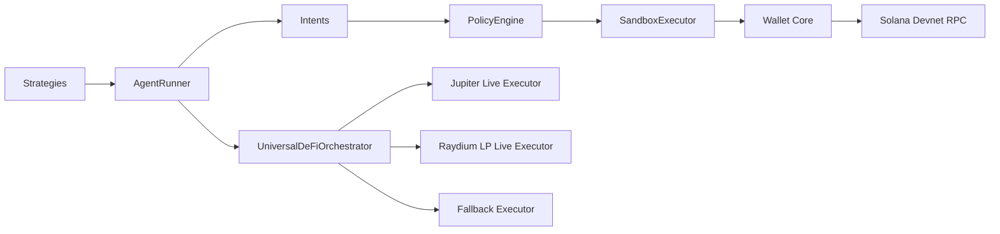

# PRKT Architecture Deep Dive

## Overview

PRKT is a layered agentic wallet runtime designed for secure autonomous operation on Solana devnet.

## Architecture Diagram



## Layer 1: Wallet Core

Path: `src/core`

Responsibilities:

- Wallet creation/loading (`WalletManager`)
- RPC abstraction (`RpcClient`)
- Build/simulate/send/confirm transactions (`TransactionService`)
- ATA + mint helpers (`TokenService`)
- SOL/SPL balances (`BalanceService`)

Rules:

- No strategy logic
- No policy decisions

## Layer 2: Policy + Sandbox

Path: `src/policy`

Responsibilities:

- Spend limits (per tx/session/day)
- Program and mint allowlists
- Unknown instruction deny-default
- Simulation-gated execution
- Approval modes (`sandbox` and `live`)
- Security audit trail

Key components:

- `PolicyEngine`
- `SandboxExecutor`
- `TxInspectionResult`

## Layer 3: Agent Runner

Path: `src/agent`

Responsibilities:

- Strategy loop and intent production
- Agent context isolation (wallet/config/policy)
- Parallel agent execution
- No direct key handling in strategy layer

Key components:

- `AgentRunner`
- `AgentRegistry`
- Typed intents (`transfer-sol`, `transfer-spl`, `mint-token`, `write-memo`, `defi-capability`)
- Strategies including universal DeFi capability strategy

## Layer 4: Protocol Interaction

Paths: `src/defi`, `src/demo`, `src/scripts`

Responsibilities:

- Protocol adapter model for Solana DeFi capabilities
- Live-first execution for devnet where available
- Safe fallback mode when live prerequisites fail

Current live protocol paths:

- Jupiter swap execution
- Raydium LP add-liquidity execution

## CLI Layer (Orchestration Only)

Path: `src/cli`

The CLI is an operational control plane that orchestrates existing layers:

- Wallet commands call Wallet Core services.
- Policy commands call PolicyEngine inspection.
- Agent commands call AgentRunner and universal DeFi executor flow.
- Monitor/audit commands read lightweight persistent state in `artifacts/`.

The CLI does not introduce protocol or policy business logic into command handlers.

## Security Model

### Assumptions

- Agent decision logic may be wrong or compromised.
- Operators may misconfigure environment settings.

### Controls

- Isolation: each agent gets an independent context
- Policy: hard limits + allowlists
- Sandbox: simulation and approval gating before broadcast
- Auditability: explicit allow/deny reasoning
- Live-first fallback: avoid uncontrolled failures while preserving determinism

### Residual Risks

- Bad external protocol config (for example invalid Raydium pool accounts)
- Operator key management issues
- Incomplete live adapter coverage for all protocols
- CLI wallet persistence is intended for local demo operations, not production custody

## Step-by-Step Devnet Demo Flow

1. Set env for devnet:
- `SOLANA_RPC_URL=https://api.devnet.solana.com`
- `REMOTE_SIGNER_URL=...`
- `REMOTE_SIGNER_BEARER_TOKEN=...`
- `REMOTE_SIGNER_PUBKEY=...`
- `AGENT_PRIVATE_KEY=[...]` for local devnet/demo use only
- `USDC_MINT=4zMMC9srt5Ri5X14GAgXhaHii3GnPAEERYPJgZJDncDU`

2. Enable live-first execution:
- `UNIVERSAL_DEFI_LIVE_FIRST=true`
- `ENABLE_LIVE_SWAP_PATH=true`
- `KORA_MOCK_MODE=false`
- optionally `ENABLE_LIVE_RAYDIUM_LP=true`

3. For Raydium live LP, create `raydium_lp.devnet.json` from `raydium_lp.devnet.example.json`.

4. Run universal capability demo:
```bash
npm run defi:universal
```

5. Run agent-runner universal flow:
```bash
npm run agent:defi:universal
```

6. Validate output:
- live signatures for available live paths
- explicit fallback messages where live requirements are missing
- final per-action execution results
