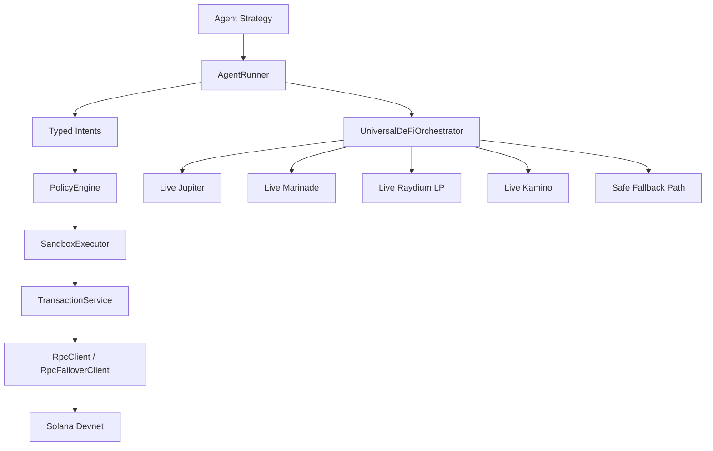

# PRKT — Operator Runbook

Policy-enforced agentic wallet runtime for Solana. Agents decide intent; policy, simulation, and execution controls decide what actually executes.

Canonical full documentation for users and website publishing:
- [FULL_DOCUMENTATION.md](./FULL_DOCUMENTATION.md)

## 5-Minute Devnet Quickstart

### 1. Install

Published CLI:

```bash
npm install -g @prktsol/prkt
prkt --help
prkt init
prkt-devnet-matrix
```

Typed Node SDK surface:

```js
const { WalletManager, PolicyEngine, SessionAnchor } = require("@prktsol/prkt");
```

From source:

```bash
git clone <repo-url> && cd PRKT
npm install
npm run cli -- --help
npm run cli -- init
npm run demo:feature-matrix:devnet
```

### 2. Configure environment

```bash
cp .env.example .env
```

Protocol-specific presets are available if you want a faster start:
- `.env.devnet.autonomous.example`
- `.env.devnet.marinade.example`
- `.env.devnet.jupiter.example`
- `.env.devnet.kamino.example`
- `.env.devnet.orca.example`
- `.env.devnet.raydium.example`
- `.env.devnet.all-protocols.example`

Edit `.env`:

| Variable | Required | Default | What to set |
|----------|----------|---------|-------------|
| `SOLANA_RPC_URL` | Yes | `https://api.devnet.solana.com` | Devnet RPC endpoint |
| `SOLANA_RPC_FALLBACK_URL` | No | none | Optional secondary RPC for failover |
| `AGENT_PRIVATE_KEY` | Optional | `[]` | Only for operator-funded wallet demos; the autonomous devnet demo generates its own wallet |
| `DEVNET_TREASURY_PRIVATE_KEY` | No | `[]` | Optional funded devnet treasury used as an internal faucet for generated agent wallets |
| `USDC_MINT` | No | devnet USDC | Override only if using a custom mint |
| `KORA_MOCK_MODE` | No | `true` | Set `false` for live Kora gasless signing; demo scripts fall back to mock if Kora is unavailable |
| `ENABLE_LIVE_SWAP_PATH` | No | `false` | Set `true` for live Jupiter swaps |
| `ENABLE_LIVE_RAYDIUM_LP` | No | `false` | Set `true` for live Raydium LP |
| `ENABLE_LIVE_KAMINO` | No | `false` | Set `true` for live Kamino lending / borrowing |
| `ENABLE_LIVE_MARINADE` | No | `false` | Set `true` for live Marinade staking |
| `KAMINO_LIVE_CONFIG_PATH` | No | `kamino_live.json` | Path to Kamino live config copied from `kamino_live.example.json` |
| `ZK_COMPRESSION_API_URL` | No | none | Light / ZK Compression API endpoint for memo-free compressed account storage on devnet |
| `ZK_PROVER_URL` | No | none | Optional Light prover endpoint; defaults to `ZK_COMPRESSION_API_URL` when omitted |
| `IMPLEMENTATION_PATH` | No | `strict_live` | Set `defensible_devnet_demo` to allow commitment-backed fallback storage when full Light data-account writes are unavailable on devnet |
| `NEON_BROADCAST_ENABLED` | No | `false` | Set `true` only when you want PRKT to broadcast Neon EVM transactions instead of failing closed |
| `ONCHAIN_POLICY_GUARD_PROGRAM_ID` | No | `3sUkfLW4jtwSQFgdtWyEj8FPedtvKfXSB1J16PMUZhMG` | Override for the deployed devnet onchain policy/verifier program |
| `POLICY_SESSION_TTL_MINUTES` | No | `60` | Session TTL in minutes (1–1440) |

> **Production**: Use `REMOTE_SIGNER_URL`, `REMOTE_SIGNER_BEARER_TOKEN`, and `REMOTE_SIGNER_PUBKEY` instead of `AGENT_PRIVATE_KEY`. All three must be set together.

For the autonomous bounty demo, set `ENABLE_LIVE_MARINADE=true`. No pre-existing wallet is required, but setting `DEVNET_TREASURY_PRIVATE_KEY` lets generated wallets fund from your own devnet treasury instead of the public faucet.

Reviewer-demo note: set `SOLANA_RPC_FALLBACK_URL` and `DEVNET_TREASURY_PRIVATE_KEY` before recording or sharing a live demo. The proof/session/policy path prefers real Light compressed storage on devnet, so also set `ZK_COMPRESSION_API_URL` and optionally `ZK_PROVER_URL`. In `IMPLEMENTATION_PATH=defensible_devnet_demo`, PRKT will fall back to on-chain commitment anchors plus a local payload registry if full Light data-account writes are unavailable.
The deployed devnet onchain policy/verifier program in this repo is `3sUkfLW4jtwSQFgdtWyEj8FPedtvKfXSB1J16PMUZhMG`.

### 3. Run the autonomous agent wallet demo

```bash
npm run demo:autonomous-agent-wallet:devnet
```

Expected output: generated wallet address, devnet funding signature, live Marinade staking signature, and an owner emergency-lock block message.

### 3a. Run the full devnet feature matrix

This is the fastest one-command proof that the wallet stack is tryable on devnet. It exercises the CLI, managed wallets, SPL flows, policy controls, agent runtime, monitor/audit views, gasless memo path, security simulation, and the proof/session/policy anchoring path. With `ZK_COMPRESSION_API_URL` configured, the proof/session/policy path prefers Light compressed account storage on devnet and can fall back to commitment anchors in `defensible_devnet_demo` mode.

```bash
npm run demo:feature-matrix:devnet
```

Published install:

```bash
prkt-devnet-matrix
```

Artifacts:
- `artifacts/devnet-feature-matrix.json`
- `artifacts/devnet-feature-matrix.md`

Optional live-expansion flags:
- `PRKT_DEVNET_MATRIX_INCLUDE_PROTOCOL_LIVE=1`
- `PRKT_DEVNET_MATRIX_INCLUDE_STRESS=1`
- `PRKT_DEVNET_MATRIX_INCLUDE_EXPORTS=1`

### 4. Run the autonomous portfolio demo

```bash
npm run demo:autonomous-portfolio:devnet
```

Expected output: generated wallet address, funding signature, simulated Jupiter swap intent signature on devnet, live Orca LP signature, and Kamino deposit/borrow signatures that are live-first with simulated fallback on the same wallet.
Current devnet behavior: Orca runs live; Kamino is attempted live first and then falls back to simulated deposit/borrow intents if the selected devnet market cannot refresh reserves.
On devnet, the Jupiter step stays simulated because Jupiter’s swap programs are mainnet-only; the LP and lending legs run live on the generated wallet.

### 5. Optional operator-funded wallet demo

```bash
npm run wallet:devnet
```

This path uses `AGENT_PRIVATE_KEY` or the remote signer and demonstrates direct wallet-controlled execution.

### 6. Verify

```bash
npm run release:check
```

Build and automated checks should pass. `release:check` will still fail until the manual mainnet gate items in `PRODUCTION_READINESS_TODO.md` are completed.

---

## Architecture



### 4-Layer Design

1. **Wallet Core** (`src/core`) — RPC abstraction, tx building/simulation/sending, token and balance services, idempotency guard, RPC failover
2. **Policy + Sandbox** (`src/policy`) — Tx inspection, limits, allowlists, audit trail, simulation and approval gating
3. **Agent Runner** (`src/agent`) — Strategy execution, intent orchestration, isolated agent contexts, rate limits, circuit breakers
4. **Protocol Interaction** (`src/defi`, `src/demo`, `src/scripts`) — Live-first devnet scripts and universal DeFi harness

---

## Commands

### Core

| Command | Mode | Description |
|---------|------|-------------|
| `npm run build` | — | TypeScript compile |
| `npm test` | — | Run all tests |
| `npm run test:coverage` | — | Tests with coverage |
| `npm run release:check` | — | Preflight readiness check |
| `npm run cli -- --help` | — | CLI help |

| `npm run wallet:status` | — | Local wallet status smoke check |
| `npm run demo:feature-matrix:devnet` | `LIVE` / `SIMULATED` | One-command devnet tryability run with JSON and Markdown artifacts |
| `npm run onchain:policy-guard:devnet` | `LIVE` | Fresh operator wallet, onchain policy init, program-vault funding, session open, onchain proof verification, managed transfer, session close |

### Live Devnet

| Command | Mode | Description |
|---------|------|-------------|
| `npm run demo:autonomous-agent-wallet:devnet` | `LIVE` | Provision or reuse the assigned agent wallet, fund on devnet, stake via Marinade, and show owner stop control |
| `npm run demo:autonomous-portfolio:devnet` | `LIVE` / `SIMULATED` | Provision or reuse the assigned agent wallet, fund on devnet, then execute a Jupiter swap intent plus live Orca LP and a live-first Kamino deposit/borrow path that falls back to simulated intents when devnet reserve refresh is broken |
| `npm run wallet:devnet` | `LIVE` | Wallet demo with wSOL wrap |
| `npm run defi:stake:devnet -- 0.15` | `LIVE` | Marinade stake on devnet |
| `npm run defi:orca:devnet -- 0.05` | `LIVE` | Orca Whirlpool LP position on devnet |
| `npm run defi:lp:devnet` | `LIVE` | Raydium LP on devnet |
| `npm run defi:kamino:devnet -- deposit` | `LIVE` / `SIMULATED` | Kamino deposit on devnet, with simulated fallback when the selected devnet market cannot execute live |
| `npm run defi:kamino:devnet -- borrow` | `LIVE` / `SIMULATED` | Kamino borrow on devnet, with simulated fallback when the selected devnet market cannot execute live |
| `npm run demo:multi-agent:devnet` | `LIVE` | Multi-agent devnet demo |
| `npm run simulate-attack` | `LIVE` | Security guardrail demo |
| `npm run stress:agents` | `LIVE` | Rate limit + circuit breaker demo |

Set `PRKT_AGENT_NAME=<agent-id>` to pin these autonomous/live scripts to a specific persistent agent wallet across reruns.
Set `PRKT_DEVNET_MATRIX_INCLUDE_PROTOCOL_LIVE=1` to make the feature matrix attempt the full live protocol tranche as well.

### Simulated

| Command | Mode | Description |
|---------|------|-------------|
| `npm run defi:universal` | `SIMULATED` | All DeFi capabilities (memo path) |
| `npm run agent:defi:universal` | `SIMULATED` | Agent-runner universal harness |
| `npm run defi:borrow` | `SIMULATED` | Kamino borrow simulation |
| `npm run defi:all` | `SIMULATED` | Full DeFi suite |

### CLI Areas

- **Wallet**: `wallet create`, `wallet list`, `wallet show`, `wallet fund`, `wallet balance`, `wallet export-secret`, `wallet transfer-sol`, `wallet transfer-spl`
- **Token**: `token mint-demo`, `token create-ata`
- **Policy**: `policy show`, `policy validate-intent`
- **Provider policy presets**: `policy presets`, `policy set-preset`, `policy set-limits`, `policy clear-overrides`
- **Agent**: `agent create`, `agent fund`, `agent balance`, `agent export-wallet`, `agent list`, `agent show`, `agent run`, `agent run-all`, `agent stop`, `agent logs`
- **Monitoring**: `monitor overview`, `monitor balances`, `monitor txs`, `monitor agents`, `monitor watch`
- **Platform**: `doctor`, `config show`, `audit`, `completion`

### Agent Provisioning

Managed agents are now agent-first:

- `agent create --agent <agent-id> --owner <user-id>` provisions a persistent wallet for that agent
- the wallet secret is stored encrypted for autonomous execution
- the CLI returns a one-time `recoveryKey` that the user can use with `agent export-wallet` for full custody export
- the default custody model is local-per-user: each install gets its own local wallet encryption key and local state directory
- `PRKT_WALLET_MASTER_KEY` is an advanced override for managed/server deployments; if unset, PRKT creates a per-user local key file in the PRKT CLI data directory (`%APPDATA%/PRKT` on Windows, `~/Library/Application Support/PRKT` on macOS, `${XDG_DATA_HOME:-~/.local/share}/prkt` on Linux)
- `PRKT_CLI_HOME` optionally pins that local state to a specific directory
- `PRKT_AGENT_NAME` and optional `PRKT_OWNER_ID` let autonomous/live scripts provision or reuse a specific managed agent wallet

### Provider Policy Defaults

Auto-created wallets are usable immediately. When you create a wallet or agent, PRKT attaches the `auto-devnet-safe` provider preset by default, which keeps the wallet autonomous but constrained:

- sandbox approval mode
- conservative per-tx and per-session limits
- unknown instructions denied by default
- simulation required before broadcast
- only explicitly allowed protocol exceptions permitted

Operators can inspect and adjust the policy without editing code:

```bash
npm run cli -- policy presets
npm run cli -- policy show --agent <agent>
npm run cli -- policy set-preset --agent <agent> --preset guarded-live
npm run cli -- policy set-limits --agent <agent> --max-sol-per-tx-lamports 500000000
```

---

## Security Model

### Controls

- Agent isolation per wallet/config
- Program and mint allowlists
- Spend limits per tx/session/day
- Unknown instructions denied by default
- SPL delegate approval, close-account drain, and authority change blocking
- Simulation required before broadcast (sandbox path)
- Emergency kill switch (env, file, HMAC-signed command)
- Session TTL (configurable, max 24h)
- Rate limiting and circuit breakers per agent
- Post-transaction balance verification

### Key Management

- **Production**: `REMOTE_SIGNER_URL` + bearer auth + `REMOTE_SIGNER_PUBKEY`
- **Devnet/demo only**: `AGENT_PRIVATE_KEY` as JSON integer array
- **Managed agent wallets**: encrypted locally per user, with an optional `PRKT_WALLET_MASTER_KEY` override for managed/server environments, plus a user-held recovery key for export

### Caveats

- CLI-managed wallets are local-only custody unless you move them behind a remote signer/HSM-backed service
- `AGENT_PRIVATE_KEY` is a devnet escape hatch, not for production
- See `artifacts/security-deep-dive.md` for full threat model

## Local User Custody Model

PRKT is designed so users can install the CLI and operate their own agent wallets locally.

- each user install keeps its own encrypted wallet registry and activity log
- each user install gets its own local encryption key by default
- agents can autonomously create and use wallets, but every execution still resolves through the active policy preset and policy overrides
- users tighten or relax that autonomy with `policy set-preset`, `policy set-limits`, and `policy validate-intent`
- `prkt init`, `prkt config show`, and `prkt doctor` expose the current custody model, local state path, and runtime safety posture

In other words: PRKT can behave like a "Phantom for agents" without turning wallet custody into a shared backend secret.

---

## Troubleshooting

| Symptom | Cause | Fix |
|---------|-------|-----|
| `EnvConfigError: AGENT_PRIVATE_KEY must contain exactly 64 integers` | Malformed key in `.env` | Re-export from `solana-keygen` as JSON array |
| `USDC_MINT is set to the mainnet mint while RPC is devnet` | Cluster/mint mismatch | Set `USDC_MINT=4zMMC9srt5Ri5X14GAgXhaHii3GnPAEERYPJgZJDncDU` |
| `Session blocked: session has expired` | Session TTL exceeded | Restart the agent or increase `POLICY_SESSION_TTL_MINUTES` |
| `Human-in-the-loop Override engaged` | Emergency lock active | Set `emergency_lock.json` `"enabled": false` or unset `POLICY_EMERGENCY_LOCK` env |
| `Program blocked: <id> is not whitelisted` | Missing program in allowlist | Add program ID to `EXTRA_WHITELISTED_PROGRAMS` in `.env` |
| `Kamino live config not found` | Missing `kamino_live.json` | Copy `kamino_live.example.json` to `kamino_live.json` and fill in market/mint/program IDs |
| `Kamino market <id> could not be loaded` | Wrong market/program/RPC cluster | Verify `SOLANA_RPC_URL`, `ENABLE_LIVE_KAMINO=true`, and the addresses in `kamino_live.json` |
| `ReserveStale` or `InvalidOracleConfig` during Kamino devnet execution | Kamino devnet market cannot refresh reserves on-chain | Use `npm run demo:autonomous-portfolio:devnet` for the live-first + simulated-fallback demo path, or wait for Kamino to refresh/fix the devnet market |
| `Could not load the public Orca devnet SOL/devUSDC concentrated pool` | RPC unhealthy or cluster mismatch | Use a healthy devnet RPC and keep `SOLANA_RPC_URL` pointed at devnet |
| `Orca quote returned zero liquidity` | Chosen tick range or RPC state invalid | Retry with the default amount or a healthier devnet RPC |
| `Marinade live execution was not prepared` | Marinade live path disabled or unsupported cluster | Set `ENABLE_LIVE_MARINADE=true` and use a devnet RPC |
| `Marinade stake verification failed` | mSOL balance did not increase after confirmation | Check wallet funding, RPC health, and whether the transaction landed on the intended cluster |
| `Funding failed` | Devnet airdrop did not settle or faucet is rate-limited | Retry after a short delay or switch to a healthier devnet RPC |
| `Autonomous agent wallet demo requires devnet` | RPC points at the wrong cluster | Set `SOLANA_RPC_URL=https://api.devnet.solana.com` or another devnet endpoint |
| `Wallet master key is not configured` | No `PRKT_WALLET_MASTER_KEY` and no local fallback key file | Set `PRKT_WALLET_MASTER_KEY` for live deployments or allow PRKT to create the local fallback file in non-production environments |
| `Unsupported state or unable to export wallet` | Wrong `recoveryKey` or the wallet predates encrypted custody migration | Re-run provisioning for a new managed agent wallet or supply the correct recovery key returned at creation time |
| `Transfer blocked: destination is not whitelisted` | Destination not in policy | Add the destination pubkey to the agent's policy `whitelistedTransferDestinations` |
| `RPC request failed` | Devnet RPC down/rate-limited | Set `SOLANA_RPC_FALLBACK_URL` in `.env` or wait and retry |
| Build fails | TypeScript errors | Run `npx tsc --noEmit` for details |
| Tests fail | Environment contamination | Run `npm test -- --runInBand` for isolation |

---

## Deterministic Demo Sequence

For bounty judges or recorded demonstrations:

```bash
# 1. Preflight
npm run release:check

# 2. Rehearsal (generates demo-session.json)
npm run demo:rehearsal

# 3. Full devnet feature matrix
npm run demo:feature-matrix:devnet

# 4. Autonomous agent wallet demo (LIVE)
npm run demo:autonomous-agent-wallet:devnet

# 5. Autonomous portfolio demo (LIVE)
npm run demo:autonomous-portfolio:devnet

# 6. Wallet demo (LIVE)
npm run wallet:devnet

# 6. Raydium LP (LIVE) — requires raydium_lp.devnet.json
npm run defi:lp:devnet

# 8. Marinade stake (LIVE)
npm run defi:stake:devnet -- 0.15

# 9. Orca Whirlpool LP (LIVE)
npm run defi:orca:devnet -- 0.05

# 10. Kamino deposit (LIVE attempt on devnet; current portfolio demo falls back to simulated if reserve refresh is broken)
npm run defi:kamino:devnet -- deposit

# 11. Security guardrails
npm run simulate-attack

# 12. Multi-agent stress test
npm run stress:agents

# 13. Fill artifacts/bounty-evidence.md with signatures
```

---

## Repo Structure

```text
src/
  core/         # Wallet, RPC, tx service, balances, tokens, idempotency
  policy/       # PolicyGuard, PolicyEngine, SandboxExecutor, emergency lock
  agent/        # AgentManager, AgentRuntime, DecisionEngine, strategies
  defi/         # DeFi coordinators, adapters, universal orchestrator
  cli/          # Operational CLI commands
  config/       # Environment configuration
  scripts/      # Demo and utility scripts
  demo/         # Multi-agent demo scripts
tests/          # Unit and integration tests (28 suites, 100+ tests)
artifacts/      # Bounty evidence, security deep-dive
```

Full CLI reference: [CLI.md](./CLI.md) · Quick path: [CLI_QUICKSTART.md](./CLI_QUICKSTART.md) · Compatibility: [COMPATIBILITY.md](./COMPATIBILITY.md)
