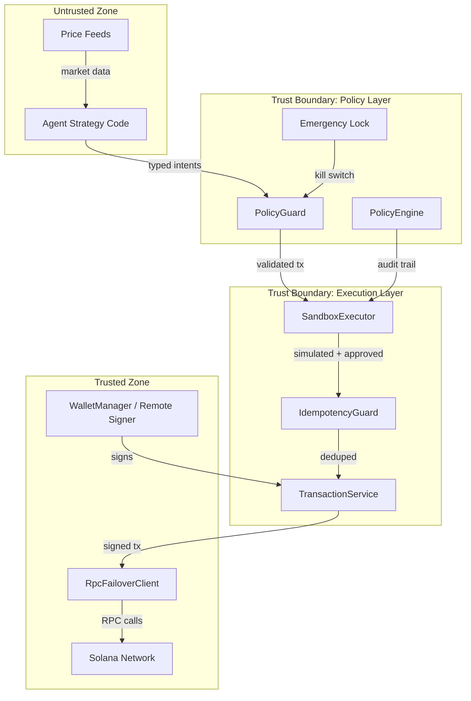

# Security Deep Dive

## Threat Model

### Threat 1: Compromised Agent Logic

**Attack**: An autonomous agent produces malicious or malformed intents (e.g., draining wallet funds to attacker-controlled address, approving unlimited token delegation).

**Mitigations**:
- `PolicyGuard` validates every transaction before broadcast
- Transfer destinations must be in the allowlist
- Spend limits enforced per-tx (SOL + SPL)
- SPL delegate approvals are unconditionally blocked
- Close-account drains are unconditionally blocked
- Authority changes (owner, close, mint) are blocked
- Opaque instructions from non-core programs are denied by default
- `SandboxExecutor` requires simulation success before broadcast

**Residual Risk**: If the allowlist itself is misconfigured to include attacker addresses, policy will not block transfers. Mitigation: operator review of policy config.

### Threat 2: Misconfigured Environment

**Attack**: Operator accidentally sets mainnet RPC with devnet USDC mint, or leaves default session expiry at unsafe values.

**Mitigations**:
- `assertMintMatchesRpcCluster()` fails fast on cluster/mint mismatch
- Session TTL bounded to 1–1440 minutes (enforced by `getPolicySessionTtlMinutes()`)
- `AGENT_PRIVATE_KEY` documented as devnet-only; production requires `REMOTE_SIGNER_*`
- `release:check` validates configuration before demo/deploy

**Residual Risk**: Custom RPC URLs that don't contain cluster indicators may bypass detection. Mitigation: operator verification.

### Threat 3: RPC Manipulation

**Attack**: Man-in-the-middle on RPC endpoint returns false simulation results or blocks confirmations.

**Mitigations**:
- `PostTransactionVerifier` independently verifies expected balance changes after confirmation
- `RpcFailoverClient` switches to fallback endpoint on persistent failures
- Simulation-gated execution catches state inconsistencies before broadcast

**Residual Risk**: If both primary and fallback RPC are compromised, verification is unreliable. Mitigation: use trusted RPC providers with TLS.

### Threat 4: Credential Leakage

**Attack**: Private key or bearer token exposed through logs, env leaks, or version control.

**Mitigations**:
- `redactSecretForLogs()` prevents key material in log output
- `.gitignore` excludes `.env` and `.env.local`
- `.env.example` uses placeholder values
- Remote signer requires all 3 fields (URL, token, pubkey) — partial config throws

**Residual Risk**: If operator commits `.env` directly. Mitigation: pre-commit hooks (not implemented).

---

## Trust Boundaries

**Key boundaries**:
1. **Agent → Policy**: All agent output is validated. Agents cannot bypass policy.
2. **Policy → Execution**: Only policy-approved, simulation-passed transactions proceed.
3. **Execution → Network**: Transactions are signed by trusted signer and sent via failover RPC.

---

## Key Management

| Mode | Mechanism | Security Level | Use Case |
|------|-----------|---------------|----------|
| Local key (`AGENT_PRIVATE_KEY`) | JSON array in `.env` | Low — key at rest in plaintext | Devnet demos, local development |
| Remote signer (`REMOTE_SIGNER_*`) | HTTPS + bearer auth | Medium — key never leaves signer service | Production, staging |
| HSM/KMS (future) | Hardware security module | High — key never extractable | High-value production |

**Rules**:
- `AGENT_PRIVATE_KEY` must not be set when `REMOTE_SIGNER_*` is configured
- `REMOTE_SIGNER_*` requires all 3 variables (URL, bearer token, pubkey)
- Partial remote signer config throws `EnvConfigError`

---

## Spend Vector Coverage

| Vector | Guard | Policy Check |
|--------|-------|-------------|
| SOL transfer | `SystemInstruction.decodeTransfer` | Destination allowlist + spend limit |
| SPL Transfer | `decodeTransferInstruction` | Destination allowlist + spend limit |
| SPL TransferChecked | `decodeTransferCheckedInstruction` | Destination + mint allowlist + spend limit |
| SPL Approve/ApproveChecked | `decodeApproveInstruction` / `decodeApproveCheckedInstruction` | Unconditionally blocked |
| SPL Revoke | `decodeRevokeInstruction` | Requires explicit approval |
| Close Account | `decodeCloseAccountInstruction` | Unconditionally blocked |
| Set Authority (owner/close/mint) | `decodeSetAuthorityInstruction` | Unconditionally blocked |
| Opaque instruction | N/A | Blocked unless program is in `allowOpaqueProgramIds` |

---

## Incident Response Model

### Detection

| Signal | Source | Action |
|--------|--------|--------|
| Unexpected transaction | Audit trail (`PolicyEngine.getAuditTrail()`) | Alert operator |
| Balance deviation | `PostTransactionVerifier.assertBalanceChanges()` | Throw + log |
| Repeated failures | `AgentExecutionController` circuit breaker | Auto-pause agent |
| Rate limit hit | `AgentExecutionController` | Auto-block for cooldown window |

### Containment

1. **Immediate**: Set `POLICY_EMERGENCY_LOCK=true` in environment OR set `emergency_lock.json` `"enabled": true`
2. **Signed command**: Issue HMAC-signed emergency command via `emergency_command.json` (remote-capable)
3. **Per-agent**: Circuit breaker auto-pauses after consecutive failures (default: 3 failures → 30s cooldown)

### Recovery

1. Diagnose root cause from audit trail (`npm run cli -- audit`)
2. Fix policy/config
3. Clear emergency lock
4. Resume with a fresh agent session (session TTL forces re-authentication)
5. Verify balances post-recovery (`npm run cli -- monitor balances`)

### Post-Incident

- Capture audit trail for forensics
- Update policy config to prevent recurrence
- If keys were compromised: rotate keys, revoke all token approvals, transfer remaining funds

---

## Residual Risks

| Risk | Severity | Status |
|------|----------|--------|
| Bad external protocol config (e.g., invalid Raydium pool accounts) | Medium | Accepted — operator responsibility |
| Operator key management errors | High | Mitigated by remote signer support |
| Incomplete live adapter coverage | Low | Accepted — fallback mode handles gracefully |
| Local wallet persistence for demos | Medium | Documented as not production custody |
| No hardware wallet / HSM integration | Medium | Planned for future |
| No pre-commit hooks for secret detection | Low | Recommended but not enforced |
